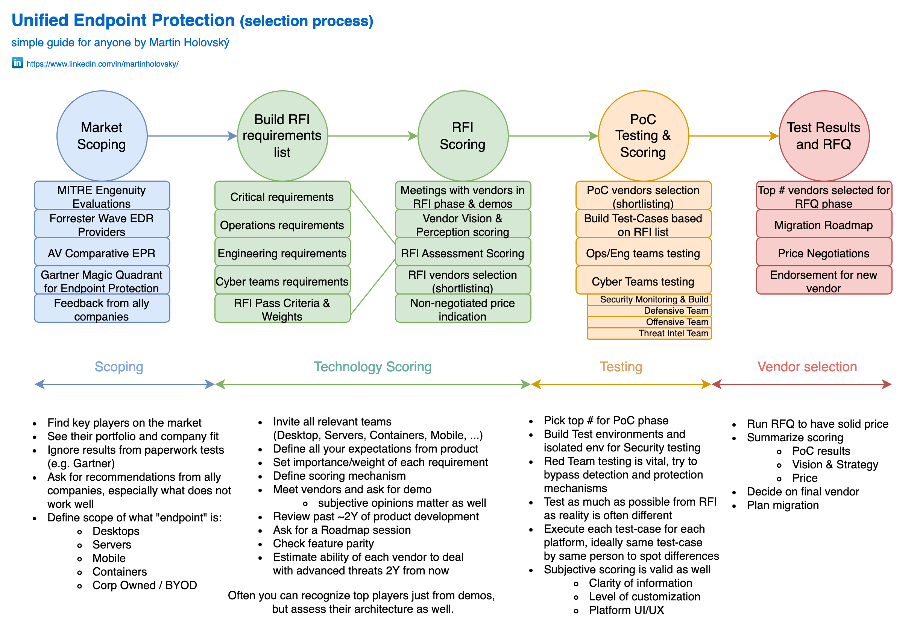

I wanted to share with you my standard process for the selection of new Unified Endpoint Protection / XDR, which I used a couple of times in the past, but never documented, so this article is also used for my documentation purposes :)
Each company is unique, but threats are the same for most of them. Feel free to reuse and modify for your needs.

[PNG](./images/XDR_selection.png) | [PDF](./images/XDR_selection.pdf)

